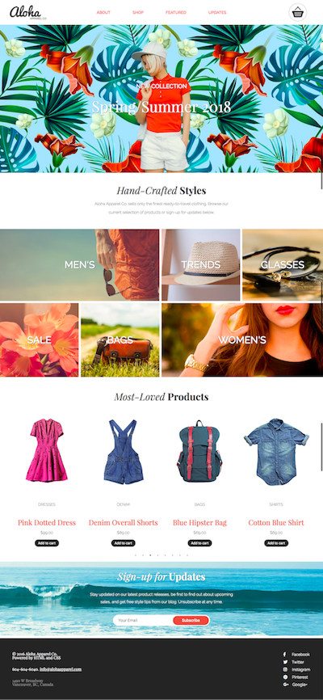

A project I completed during the Web Developer program at RED Academy
The page is responsive and was coded with a mobile-first approach

Technologies used:
HTML5
CSS3
jQuery

Screenshots:

Desktop version:

Tablet Version:

Mobile Version:

